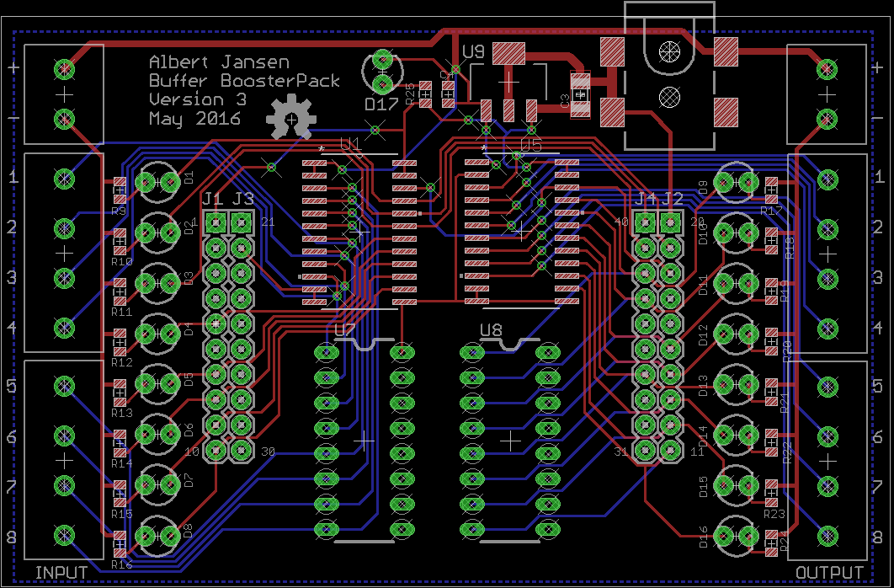

# Buffer Booster Pack
## Overview
The Buffer Booster Pack is a simple Booster Pack for TI's LaunchPad development ecosystem that connects eight 5V inputs and eight 5V outputs to the 3.3V inputs and outputs of the LaunchPad. There are indicators and screw terminal connections for each input, as well as screw terminals connections for 5V and GND, to easily interface with proto-typed circuits.

## Pinout
The Buffer Booster Pack is made for a 40-pin booster pack, and follows the Booster Pack Standard. The external input and output numbering is shown on the board.

|External Input| Booster Pack Pin # ||External Output| Booster Pack Pin # |
|:------------:|:------------------:||:-------------:|:------------------:|
|1|7||1|38|
|2|8||2|37|
|3|9||3|15|
|4|10||4|14|
|5|5||5|34|
|6|39||6|13|
|7|40||7|12|
|8|19||8|11|

## Firmware Examples
Two examples are included in the firmware folder. There is one for Energia, which uses standard Booster Pack pinouts, and the other is for the F28069 LaunchPad with Code Composer Studio.

## Power
The Buffer Booster Pack supplies 3.3V to the 3V3 pin of the target Launchpad. The 5V pin is not connected, and the external DC Jack must be connected in order for the Booster Pack to function correctly.

## To-Do
- Final hardware tests (need to wait until boards arrive)

## License
 
This work is licensed under a [Creative Commons Attribution-ShareAlike 3.0 Unported License](http://creativecommons.org/licenses/by-sa/3.0/)
